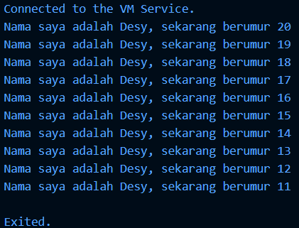

# Laporan Praktikum #02 - Pemrograman Dasar Dart - Bag.1 (Variabel dan Tipe Data)

| Atribut | Keterangan        |
| ------- | -----             |
| Nama    | Desy Dwi Puspita  |
| NIM     | 244107060145      |
| Kelas   | SIB-2E            |

---

## Soal 1 

Modifikasilah kode pada baris 3 di VS Code atau Editor Code favorit Anda berikut ini agar mendapatkan keluaran (output) sesuai yang diminta!

```dart
void main() {
  for (int i = 0; i < 10; i++) {
    print("Hello ${i + 2}");
  }
}
```

## Jawaban:

```dart
void main() {
  for (int i = 0; i < 10; i++) {
    print('Nama saya adalah Desy, sekarang berumur ${20 - i}');
  }
}
```


---

## Soal 2

Mengapa sangat penting untuk memahami bahasa pemrograman Dart sebelum kita menggunakan framework Flutter ? Jelaskan!

## Jawaban:

Karena Dart adalah bahasa pemrograman yang digunakan pada Flutter, kita harus memahami dasarnya agar pengembangan aplikasi berjalan lancar. Dengan memahami Dart, kita dapat menguasai struktur program, memahami OOP, menangani error dengan mudah, dan menulis kode Flutter yang lebih efisien.

--- 

## Soal 3

Rangkumlah materi dari codelab ini menjadi poin-poin penting yang dapat Anda gunakan untuk membantu proses pengembangan aplikasi mobile menggunakan framework Flutter.

## Jawaban: 

**Rangkuman Materi Codelab Dart untuk Pengembangan Flutter**

**1. Dart sebagai bahasa utama flutter**
Dart adalah bahasa pemrograman utama pada Flutter untuk membuat aplikasi mobile, web, dan desktop. 

**2. Kelebihan dan Alasan menggunakan Dart** 
Dart memiliki fitur modern yang mendukung pengembangan aplikasi, seperti:
* Productive tooling (dukungan IDE dan package yang lengkap)
* Garbage collection (manajemen memori otomatis)
* Type annotations & statically typed (mengurangi bug)
* Portability (bisa dikompilasi ke native dan web)

**3. Cara Kerja Dart**
Dart dapat dijalankan dengan dua cara:
* Dart VM: Digunakan saat development (mendukung debugging dan hot reload).
* Kompilasi ke JavaScript: Untuk aplikasi web.
Dart juga memiliki dua metode kompilasi:
* JIT (Just-In-Time): Digunakan saat pengembangan, mendukung hot reload.
* AOT (Ahead-Of-Time): Digunakan saat aplikasi dirilis, performa lebih cepat.

**4. Struktur Dasar dan OOP**
Dart menggunakan konsep Object-Oriented Programming (OOP):
* Semua tipe data adalah objek.
* Menggunakan class dan object.
* Mendukung encapsulation dan inheritance.

**5.Operator dan Sintaks Dasar**
Dart memiliki operator dasar seperti:
* Aritmatika (+, -, *, /, %)
* Relasional dan equality (==, !=, >, <)
* Logika (&&, ||, !)
* Increment dan decrement (++, --)

---

## Soal 4

Buatlah penjelasan dan contoh eksekusi kode tentang perbedaan Null Safety dan Late variabel !

## Jawaban:

**1. Null Safety** adalah fitur Dart yang mencegah variabel bernilai `null` tanpa sengaja.
Secara default, variabel **tidak boleh kosong (null)**.
Jika ingin mengizinkan nilai null, kita harus menambahkan tanda `?` pada tipe datanya.

Contoh kode tanpa `?` (akan eror)
``` dart
void main() {
  String nama;
  print(nama); 
}
```
Contoh kode menggunakan `?`: 
```dart
void main() {
    String? nama;
    print(nama);
}
```

**2. Late Variable** digunakan jika variabel akan diisi nanti tetapi tidak boleh null saat digunakan.

Contoh kode 
``` dart
void main() {
  late String nama;
  nama = "Desy";
  print(nama);
}
```
Variabel tidak langsung diberi nilai saat deklarasi, tetapi harus diisi sebelum digunakan.

Contoh kode yang tidak diisi (akan eror)
``` dart
void main() {
  late String nama;
  print(nama);
}
```
Karena `late` menjanjikan variabel akan diisi sebelum dipakai.

