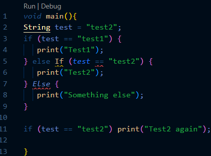
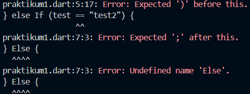

# Laporan Praktikum #03 - Pemrograman Dasar Dart - Bag.2 (Percabangan dan Perulangan)

| Atribut | Keterangan        |
| ------- | -----             |
| Nama    | Desy Dwi Puspita  |
| NIM     | 244107060145      |
| Kelas   | SIB-2E            |

---

## Tugas Praktikum

### Soal 1
Silakan selesaikan Praktikum 1 sampai 3, lalu dokumentasikan berupa screenshot hasil pekerjaan beserta penjelasannya!

#### Praktikum 1: Menerapkan Control Flows ("if/else") - langkah 1 dan 2

#### Langkah 1:
Ketik atau salin kode program berikut ke dalam fungsi `main()`.
Code: 
```dart
String test = "test2";
if (test == "test1") {
   print("Test1");
} else If (test == "test2") {
   print("Test2");
} Else {
   print("Something else");
}

if (test == "test2") print("Test2 again"); 
```

#### Langkah 2:
Silahkan coba eksekusi (Run) kode pada langkah 1 tersebut. Apa yang terjadi? Jelaskan!




Ketika kode dijalankan program tidak menampilkan output, melainkan muncul error. Terjadi karena penulisan `Else If` dan `Else` menggunakan huruf besar. Dalam bahasa Dart, penulisan bersifat case-sensitive, sehingga harus ditulis `else if` dan `else` dengan huruf kecil.

#### Langkah 3:
Tambahkan kode program berikut, lalu coba eksekusi (Run) kode Anda.
``` dart
String test = "true";
if (test) {
   print("Kebenaran");
}
```

Apa yang terjadi ? Jika terjadi error, silakan perbaiki namun tetap menggunakan if/else.
