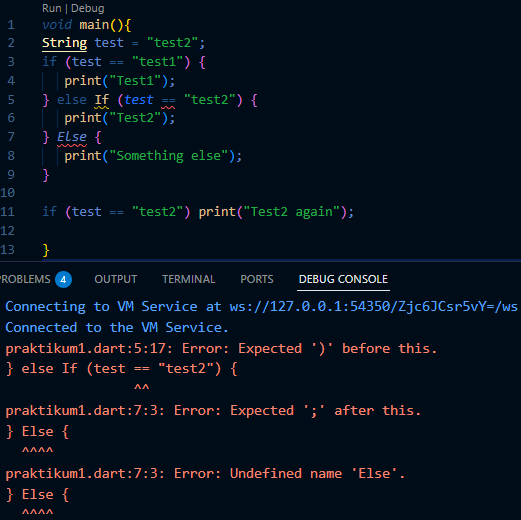
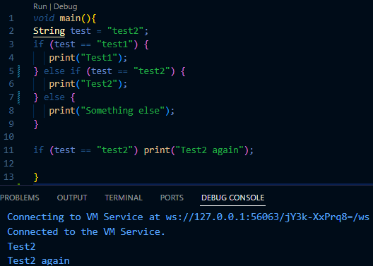
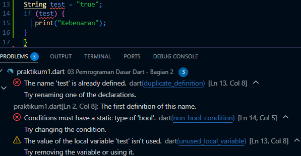
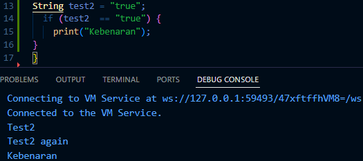
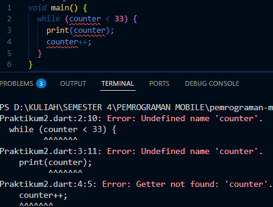

# Laporan Praktikum #03 - Pemrograman Dasar Dart - Bag.2 (Percabangan dan Perulangan)

| Atribut | Keterangan        |
| ------- | -----             |
| Nama    | Desy Dwi Puspita  |
| NIM     | 244107060145      |
| Kelas   | SIB-2E            |

---

## Tugas Praktikum

### Soal 1
Silakan selesaikan Praktikum 1 sampai 3, lalu dokumentasikan berupa screenshot hasil pekerjaan beserta penjelasannya!

#### Praktikum 1: Menerapkan Control Flows ("if/else") - langkah 1 dan 2

#### Langkah 1:
Ketik atau salin kode program berikut ke dalam fungsi `main()`.
Code: 
```dart
String test = "test2";
if (test == "test1") {
   print("Test1");
} else If (test == "test2") {
   print("Test2");
} Else {
   print("Something else");
}

if (test == "test2") print("Test2 again"); 
```

#### Langkah 2:
Silahkan coba eksekusi (Run) kode pada langkah 1 tersebut. Apa yang terjadi? Jelaskan!



Ketika kode dijalankan program tidak menampilkan output, melainkan muncul error. Terjadi karena penulisan `Else If` dan `Else` menggunakan huruf besar. Dalam bahasa Dart, penulisan bersifat case-sensitive, sehingga harus ditulis `else if` dan `else` dengan huruf kecil.



#### Langkah 3:
Tambahkan kode program berikut, lalu coba eksekusi (Run) kode Anda.
``` dart
String test = "true";
if (test) {
   print("Kebenaran");
}
```

Apa yang terjadi ? Jika terjadi error, silakan perbaiki namun tetap menggunakan if/else.
**Jawaban**



Program mengalami error saat dijalankan. Penyebabnya karena variabel `test` bertipe `String` yang berisi `"true"`, namun langsung digunakan dalam kondisi `if (test)`. Dalam Dart, pernyataan `if` hanya menerima nilai bertipe boolean (true/false). Karena yang diberikan adalah `String`, bukan boolean, maka terjadi kesalahan tipe data dan program error

**Perbaikan Kode:**
``` dart
void main() {
  String test = "test2";
  if (test == "test1") {
    print("Test1");
  } else if (test == "test2") {
    print("Test2");
  } else {
    print("Something else");
  }

  if (test == "test2") print("Test2 again");

  String test2 = "true";
  if (test2  == "true") {
    print("Kebenaran");
  }
}
```
**Hasil kode yang sudah diperbaiki**




#### Praktikum 2: Menerapkan Perulangan "while" dan "do-while"

Selesaikan langkah-langkah praktikum berikut ini menggunakan DartPad di browser Anda.

#### Langkah 1:
Ketik atau salin kode program berikut ke dalam fungsi `main()`.

```dart
  while (counter < 33) {
    print(counter);
    counter++;
  }
```

#### Langkah 2:
Silakan coba eksekusi (Run) kode pada langkah 1 tersebut. Apa yang terjadi? Jelaskan! Lalu perbaiki jika terjadi error.




#### Langkah 3:
Tambahkan kode program berikut, lalu coba eksekusi (Run) kode Anda.

``` dart
do {
  print(counter);
  counter++;
} while (counter < 77);
```

Apa yang terjadi ? Jika terjadi error, silakan perbaiki namun tetap menggunakan do-while.


