# Laporan Praktikum #04 Pemrograman Dasar Dart - Bag.3 (Collections dan Functions)

| Atribut | Keterangan        |
| ------- | -----             |
| Nama    | Desy Dwi Puspita  |
| NIM     | 244107060145      |
| Kelas   | SIB-2E            |

---

## Praktikum 1: Eksperimen Tipe Data List

### Langkah 1:

Ketik atau salin kode program berikut ke dalam `void` `main()`.

``` dart
var list = [1, 2, 3];
assert(list.length == 3);
assert(list[1] == 2);
print(list.length);
print(list[1]);

list[1] = 1;
assert(list[1] == 1);
print(list[1]);
```

### Langkah 2:

Silahkan coba eksekusi (Run) kode pada langkah 1 tersebut. Apa yang terjadi? Jelaskan!

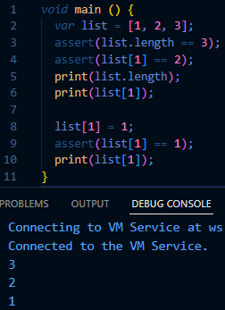

Saat kode dijalankan, program menampilkan panjang list 3 dan nilai pada indeks ke-1 yaitu 2. Nilai tersebut kemudian diubah menjadi 1 sehingga hasil yang dicetak berubah menjadi 1. `assert` digunakan untuk mengecek apakah kondisi benar, jika salah maka akan muncul error.

### Langkah 3:

Ubah kode pada langkah 1 menjadi variabel final yang mempunyai index = 5 dengan default value = `null`. Isilah nama dan NIM Anda pada elemen index ke-1 dan ke-2. Lalu print dan capture hasilnya.

Apa yang terjadi? Jika terjadi error, silahkan perbaiki.

``` dart
void main() {
  final List<dynamic> list = List.filled(5, null);

  list[1] = "Desy Dwi P";
  list[2] = "244107060145";

  print(list);
}
```

Output: 

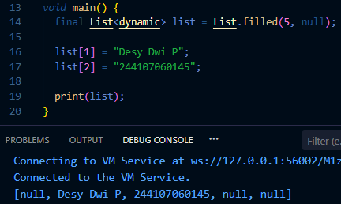

## Praktikum 2: Eksperimen Tipe Data Set

### Langkah 1: 

Ketik atau salin kode program berikut ke dalam fungsi `main()`.

``` dart
var halogens = {'fluorine', 'chlorine', 'bromine', 'iodine', 'astatine'};
print(halogens);
```

### Langkah 2: 

Silakan coba eksekusi (Run) kode pada langkah 1 tersebut. Apa yang terjadi? Jelaskan! Lalu perbaiki jika terjadi error.

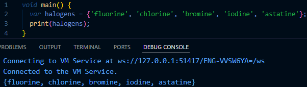

Saat kode dijalankan, program akan menampilkan isi `halogens`

### Langkah 3: 

Tambahkan kode program berikut, lalu coba eksekusi (Run) kode Anda.

``` dart
var names1 = <String>{};
Set<String> names2 = {}; // This works, too.
var names3 = {}; // Creates a map, not a set.

print(names1);
print(names2);
print(names3);
```

Apa yang terjadi ? Jika terjadi error, silakan perbaiki namun tetap menggunakan ketiga variabel tersebut. Tambahkan elemen nama dan NIM Anda pada kedua variabel Set tersebut dengan dua fungsi berbeda yaitu `.add()` dan `.addAll()`. Untuk variabel Map dihapus, nanti kita coba di praktikum selanjutnya. 

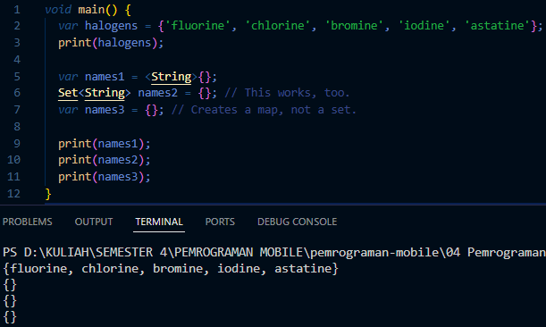

Program tidak error, tapi output yang muncul adalah kosong. Karena ketiga variabel tersebut baru dideklarasikan dan belum berisi elemen apa pun.

Kemudian saya menambahkan kode untuk menambahkan elemen nama dan NIM pada variabel Set: 

``` dart
void main() {
  var halogens = {'fluorine', 'chlorine', 'bromine', 'iodine', 'astatine'};
  print(halogens);

  var names1 = <String>{};
  Set<String> names2 = {};

  names1.add("Desy Dwi Puspita");
  names1.add("244107060145");
  names2.addAll({"Desy Dwi Puspita", "244107060145"});

  print(names1);
  print(names2);
}
```

Output: 

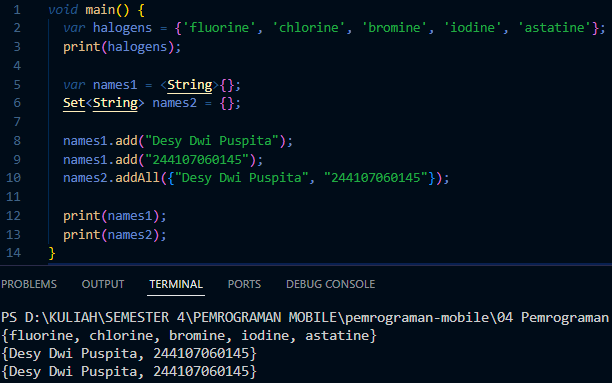

## Praktikum 3: Eksperimen Tipe Data Maps

### Langkah 1:

Ketik atau salin kode program berikut ke dalam fungsi `main()`.

``` dart
var gifts = {
  // Key:    Value
  'first': 'partridge',
  'second': 'turtledoves',
  'fifth': 1
};

var nobleGases = {
  2: 'helium',
  10: 'neon',
  18: 2,
};

print(gifts);
print(nobleGases);
```

### Langkah 2:

Silakan coba eksekusi (Run) kode pada langkah 1 tersebut. Apa yang terjadi? Jelaskan! Lalu perbaiki jika terjadi error.

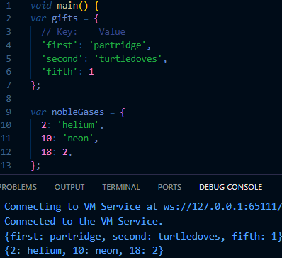

Saat kode dijalankan, program menampilkan data yang ada di dalam Map gifts dan nobleGases. Map berisi pasangan key dan value.

### Langkah 3:

Tambahkan kode program berikut, lalu coba eksekusi (Run) kode Anda.

``` dart
var mhs1 = Map<String, String>();
gifts['first'] = 'partridge';
gifts['second'] = 'turtledoves';
gifts['fifth'] = 'golden rings';

var mhs2 = Map<int, String>();
nobleGases[2] = 'helium';
nobleGases[10] = 'neon';
nobleGases[18] = 'argon';
``` 

Apa yang terjadi ? Jika terjadi error, silakan perbaiki.

Tambahkan elemen nama dan NIM Anda pada tiap variabel di atas (`gifts`, `nobleGases`, `mhs1`, dan `mhs2`). Dokumentasikan hasilnya dan buat laporannya!

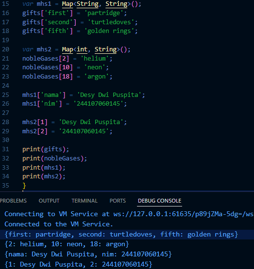

Kode di atas untuk membuat map mhs1 dan mhs2 dibuat dengan cara menambahkan elemen ke dalam map dengan key-value yang berbeda-beda. Jika key yang digunakan sudah ada di dalam map, maka nilai yang baru akan ditambahkan ke dalam key tersebut.

## Praktikum 4: Eksperimen Tipe Data List: Spread dan Control-flow Operators

### Langkah 1:

Ketik atau salin kode program berikut ke dalam fungsi `main()`.

``` dart
var list = [1, 2, 3];
var list2 = [0, ...list];
print(list1);
print(list2);
print(list2.length);
```

### Langkah 2:

Silakan coba eksekusi (Run) kode pada langkah 1 tersebut. Apa yang terjadi? Jelaskan! Lalu perbaiki jika terjadi error.

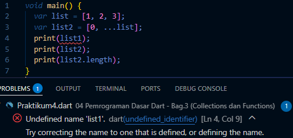

Terjadi error karena variabel `list1` belum dideklarasikan. 

Setelah diperbaiki:

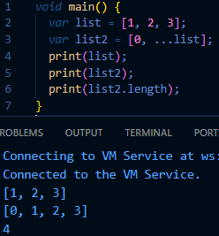

### Langkah 3:

Tambahkan kode program berikut, lalu coba eksekusi (Run) kode Anda.

``` dart
list1 = [1, 2, null];
print(list1);
var list3 = [0, ...?list1];
print(list3.length);
```

Apa yang terjadi ? Jika terjadi error, silakan perbaiki.

Tambahkan variabel list berisi NIM Anda menggunakan Spread Operators. Dokumentasikan hasilnya dan buat laporannya!

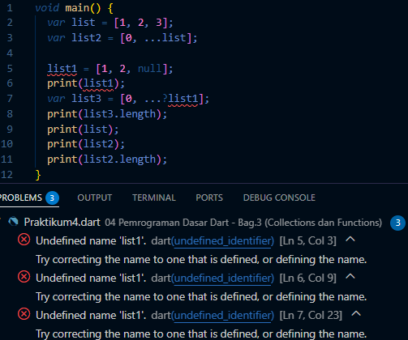

Saat kode dijalankan terjadi error karena variabel `list1` belum dideklarasikan.

Setelah diperbaiki: 

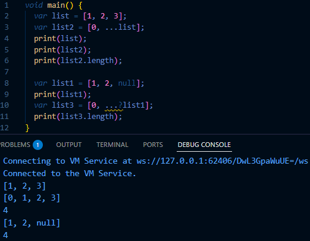

Penambahan variabel list berisi NIM Anda menggunakan Spread Operators: 

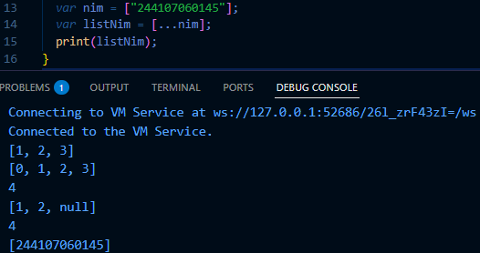

### Langkah 4:

Tambahkan kode program berikut, lalu coba eksekusi (Run) kode Anda.

``` dart
var nav = ['Home', 'Furniture', 'Plants', if (promoActive) 'Outlet'];
print(nav);
```

Apa yang terjadi ? Jika terjadi error, silakan perbaiki. Tunjukkan hasilnya jika variabel `promoActive` ketika `true` dan `false`.

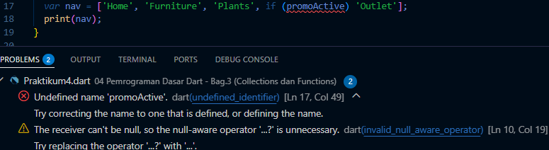

Saat kode dijalankan terjadi error karena variabel `promoActive` belum dideklarasikan.

Setelah diperbaiki: 

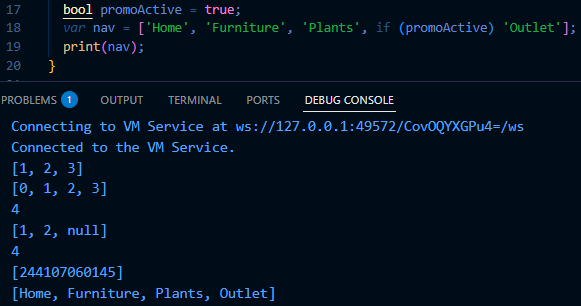

### Langkah 5:

Tambahkan kode program berikut, lalu coba eksekusi (Run) kode Anda.

``` dart
var nav2 = ['Home', 'Furniture', 'Plants', if (login case 'Manager') 'Inventory'];
print(nav2);
```

Apa yang terjadi ? Jika terjadi error, silakan perbaiki. Tunjukkan hasilnya jika variabel `login` mempunyai kondisi lain.

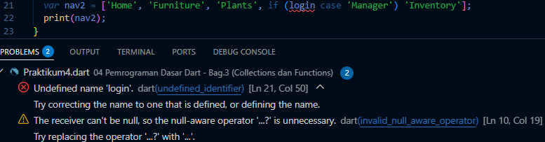

Saat kode dijalankan terjadi error karena variabel `login` belum dideklarasikan dan penggunaan case pada kondisi `if` tidak tepat. Dalam Dart, kondisi `if` harus menggunakan perbandingan nilai, misalnya dengan operator `==`.

Setelah diperbaiki: 

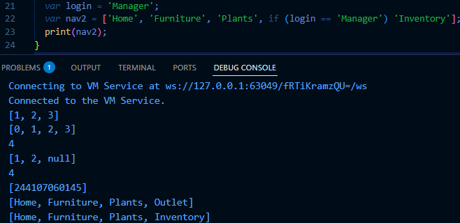

### Langkah 6:

Tambahkan kode program berikut, lalu coba eksekusi (Run) kode Anda.

``` dart
var listOfInts = [1, 2, 3];
var listOfStrings = ['#0', for (var i in listOfInts) '#$i'];
assert(listOfStrings[1] == '#1');
print(listOfStrings);
```

Apa yang terjadi ? Jika terjadi error, silakan perbaiki. Jelaskan manfaat Collection For dan dokumentasikan hasilnya.

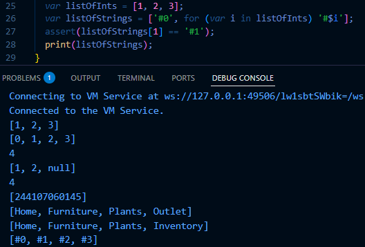

Kode ini berjalan tanpa error. Program menggunakan Collection For, yaitu cara membuat atau menambahkan elemen list secara otomatis menggunakan perulangan `for` langsung di dalam list.

Pada contoh ini, `for (var i in listOfInts) '#$i'` akan menghasilkan `'#1'`, `'#2'`, dan `'#3'`, lalu digabung dengan `'#0'` sehingga hasilnya `['#0', '#1', '#2', '#3']`.

Fungsi `assert(listOfStrings[1] == '#1')` digunakan untuk memastikan bahwa elemen pada indeks ke-1 bernilai `'#1'`.

Manfaat Collection For adalah mempermudah pembuatan list baru dari list lain sehingga kode menjadi lebih singkat, rapi, dan mudah dibaca tanpa perlu membuat perulangan terpisah.

## Praktikum 5: Eksperimen Tipe Data Records

### Langkah 1:

Ketik atau salin kode program berikut ke dalam fungsi `main()`.

``` dart
var record = ('first', a: 2, b: true, 'last');
print(record)
```

### Langkah 2:

Silakan coba eksekusi (Run) kode pada langkah 1 tersebut. Apa yang terjadi? Jelaskan! Lalu perbaiki jika terjadi error.

Saat program dijalankan akan terjadi error, karena pada `print(record)` tidak ada tanda titik koma `;`.

Setelah perbaikan: 

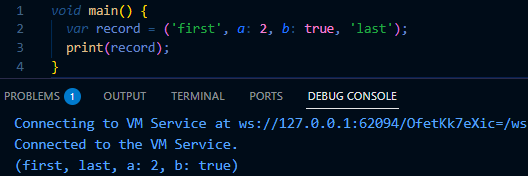

Saat kode dijalankan, program tidak mengalami error dan akan menampilkan isi variabel `record`.
`record` menyimpan beberapa data dengan tipe berbeda, yaitu String (`'first'`, `'last'`), integer (`2`), dan boolean (`true`).

### Langkah 3:
Tambahkan kode program berikut di luar scope `void main()`, lalu coba eksekusi (Run) kode Anda.

``` dart
(int, int) tukar((int, int) record) {
  var (a, b) = record;
  return (b, a);
}
```

Apa yang terjadi ? Jika terjadi error, silakan perbaiki. Gunakan fungsi `tukar()` di dalam `main()` sehingga tampak jelas proses pertukaran value field di dalam Records.

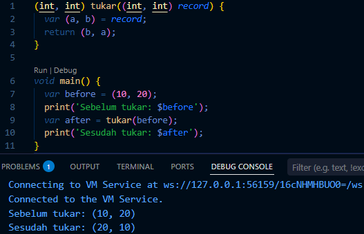

Kode ini berjalan tanpa error. Fungsi `tukar()` menerima sebuah Record bertipe `(int, int)` lalu mengembalikan Record baru dengan urutan nilainya ditukar. Hal ini dilakukan menggunakan **destructuring**, yaitu `var (a, b) = record` yang berarti memisahkan isi record ke dalam dua variabel yaitu `a` dan `b`. Setelah itu nilai tersebut dikembalikan dalam urutan yang dibalik menjadi `(b, a)`.

### Langkah 4:

Tambahkan kode program berikut di dalam scope `void main()`, lalu coba eksekusi (Run) kode Anda.

``` dart
// Record type annotation in a variable declaration:
(String, int) mahasiswa;
print(mahasiswa);
```

Apa yang terjadi ? Jika terjadi error, silakan perbaiki. Inisialisasi field nama dan NIM Anda pada variabel record `mahasiswa` di atas. Dokumentasikan hasilnya dan buat laporannya!

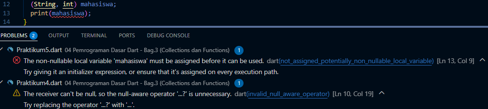

Saat kode dijalankan terjadi error, karena variabel mahasiswa sudah dideklarasikan tetapi belum diberi nilai (belum diinisialisasi).

Setelah diperbaiki: 

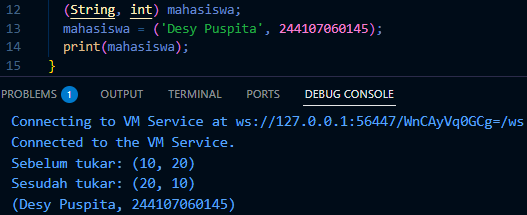

### Langkah 5:

Tambahkan kode program berikut di dalam scope `void main()`, lalu coba eksekusi (Run) kode Anda.

``` dart
var mahasiswa2 = ('first', a: 2, b: true, 'last');

print(mahasiswa2.$1); // Prints 'first'
print(mahasiswa2.a); // Prints 2
print(mahasiswa2.b); // Prints true
print(mahasiswa2.$2); // Prints 'last'
```

Apa yang terjadi ? Jika terjadi error, silakan perbaiki. Gantilah salah satu isi record dengan nama dan NIM Anda, lalu dokumentasikan hasilnya dan buat laporannya!

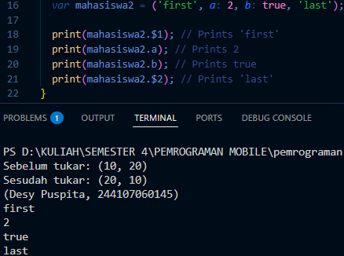

Kode setelah diganti salah satu isi record dengan nama dan NIM: 

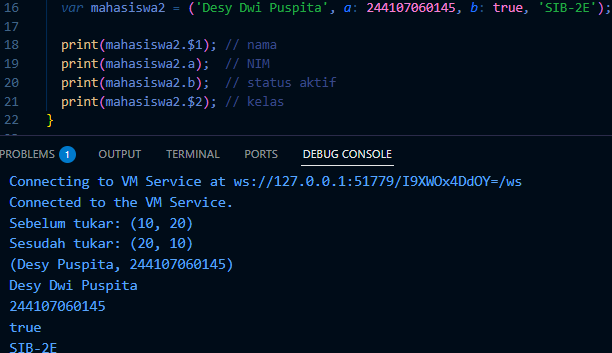

## Tugas Praktikum

### 1. Silakan selesaikan Praktikum 1 sampai 5, lalu dokumentasikan berupa screenshot hasil pekerjaan Anda beserta penjelasannya!
### 2. Jelaskan yang dimaksud Functions dalam bahasa Dart!

Function adalah sekumpulan kode yang dibuat untuk menjalankan suatu tugas tertentu dan bisa dipanggil kembali saat diperlukan. Dengan menggunakan function, penulisan program menjadi lebih terstruktur, mudah dipahami, serta dapat mengurangi penulisan kode yang berulang.

### 3. Jelaskan jenis-jenis parameter di Functions beserta contoh sintaksnya!

## 2. Jenis-jenis Parameter pada Functions

### 1. Required Parameter

Parameter yang **harus diisi** saat function dipanggil.

```dart
void sayHello(String name) {
  print("Hello $name");
}

void main() {
  sayHello("Desy");
}
```

### 2. Optional Positional Parameter

Parameter tambahan yang **tidak wajib diisi** dan ditulis menggunakan tanda `[]`.

```dart
void sayHello(String name, [String? title]) {
  print("Hello $name $title");
}

void main() {
  sayHello("Desy");
  sayHello("Desy", "Student");
}
```

### 3. Optional Named Parameter

Parameter yang ditulis dengan **nama parameter** menggunakan tanda `{}`.

```dart
void sayHello({String? name, int? age}) {
  print("Name: $name, Age: $age");
}

void main() {
  sayHello(name: "Desy", age: 20);
}
```

### 4. Default Parameter Value

Parameter yang memiliki **nilai default** jika tidak diisi saat pemanggilan function.

```dart
void sayHello({String name = "Guest"}) {
  print("Hello $name");
}

void main() {
  sayHello();
  sayHello(name: "Desy");
}
```

### 4. Jelaskan maksud Functions sebagai first-class objects beserta contoh sintaknya!

Functions sebagai first-class objects berarti function dapat diperlakukan seperti variabel atau data. Artinya, function bisa disimpan ke dalam variabel, dikirim sebagai parameter ke function lain, atau bahkan dikembalikan oleh function. Dengan cara ini, penggunaan function dalam program menjadi lebih fleksibel.

``` dart 
void sayHello(String name) {
  print("Hello $name");
}

void main() {
  var greet = sayHello;
  greet("Desy");
}
```

### 5. Apa itu Anonymous Functions? Jelaskan dan berikan contohnya!

Anonymous Function adalah function yang tidak memiliki nama dan biasanya digunakan langsung di dalam suatu perintah atau sebagai parameter pada function lain. Function ini biasanya dipakai ketika hanya dibutuhkan sekali, sehingga tidak perlu membuat function dengan nama tertentu.

``` dart
void main() {
  var numbers = [1, 2, 3];

  numbers.forEach((n) {
    print(n);
  });
}
```

Function `(n) { print(n); }` adalah anonymous function.

### 6. Jelaskan perbedaan Lexical scope dan Lexical closures! Berikan contohnya!

Lexical scope adalah kondisi di mana sebuah function dapat mengakses variabel yang berada pada lingkup tempat function tersebut didefinisikan. Artinya, function masih bisa menggunakan variabel yang ada di luar dirinya selama variabel tersebut masih berada dalam ruang lingkup kode yang sama.

``` dart
void main() {
  var name = "Desy";

  void tampil() {
    print(name);
  }

  tampil();
}
```

Lexical closure adalah kondisi ketika sebuah function tetap dapat mengakses variabel dari scope luar, walaupun function tersebut dipanggil atau dijalankan di tempat lain. Hal ini terjadi karena function tersebut “menyimpan” atau mengingat variabel dari lingkungan saat function itu dibuat.

``` dart
Function counter() {
  int count = 0;

  return () {
    count++;
    return count;
  };
}
```

### 7. Jelaskan dengan contoh cara membuat return multiple value di Functions!

``` dart
(int, int) tukar(int a, int b) {
  return (b, a);
}

void main() {
  var (x, y) = tukar(3, 5);
  print(x);
  print(y);
}
```

Return multiple value pada function adalah cara mengembalikan lebih dari satu nilai dari sebuah function. Pada Dart, hal ini bisa dilakukan menggunakan Record, yaitu tipe data yang dapat menyimpan beberapa nilai sekaligus dalam satu return.


