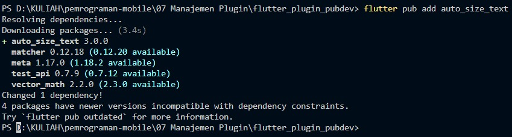
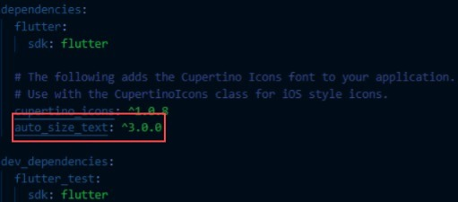
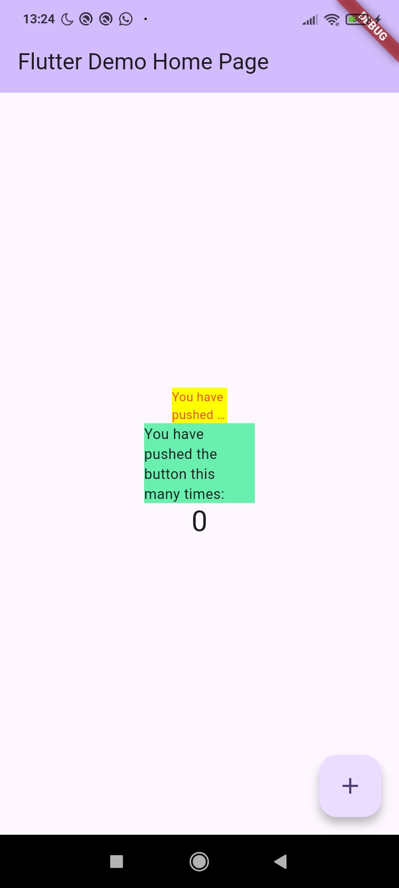

| Atribut | Keterangan        |
| ------- | -----             |
| Nama    | Desy Dwi Puspita  |
| NIM     | 244107060145      |
| Kelas   | SIB-2E            |

---
## Praktikum Menerapkan Plugin di Project Flutter

### Langkah 1: Buat Project Baru

Buatlah sebuah project flutter baru dengan nama **flutter_plugin_pubdev.** Lalu jadikan repository di GitHub Anda dengan nama **flutter_plugin_pubdev.**


### Langkah 2: Menambahkan Plugin

Tambahkan plugin `auto_size_text` menggunakan perintah berikut di terminal:

```flutter pub add auto_size_text ```



Jika berhasil, maka akan tampil nama plugin beserta versinya di file `pubspec.yaml` pada bagian dependencies.



### Langkah 3: Buat file red_text_widget.dart
Buat file baru bernama red_text_widget.dart di dalam folder lib lalu isi kode seperti berikut.

``` dart 
import 'package:flutter/material.dart';

class RedTextWidget extends StatelessWidget {
  const RedTextWidget({Key? key}) : super(key: key);

  @override
  Widget build(BuildContext context) {
    return Container();
  }
}
```

### Langkah 4: Tambah Widget AutoSizeText
Masih di file `red_text_widget.dart`, untuk menggunakan plugin `auto_size_text`, ubahlah kode `return Container()` menjadi seperti berikut.

``` dart 
return AutoSizeText(
      text,
      style: const TextStyle(color: Colors.red, fontSize: 14),
      maxLines: 2,
      overflow: TextOverflow.ellipsis,
);
```

Setelah Anda menambahkan kode di atas, Anda akan mendapatkan info error. Mengapa demikian? Jelaskan dalam laporan praktikum Anda!

jawab: 

Error pada kode tersebut disebabkan oleh widget AutoSizeText tidak dikenali karena package eksternalnya belum diimpor ke dalam berkas tersebut. Diperbaiki dengan cara menambahkan import untuk package:auto_size_text/auto_size_text.dart di bagian atas

### Langkah 5: Buat Variabel text dan parameter di constructor

Tambahkan variabel `text` dan parameter di constructor seperti berikut.

``` dart 
final String text;

const RedTextWidget({Key? key, required this.text}) : super(key: key);
```

### Langkah 6: Tambahkan widget di main.dart
Buka file `main.dart` lalu tambahkan di dalam `children:` pada `class _MyHomePageState`

``` dart
Container(
   color: Colors.yellowAccent,
   width: 50,
   child: const RedTextWidget(
             text: 'You have pushed the button this many times:',
          ),
),
Container(
    color: Colors.greenAccent,
    width: 100,
    child: const Text(
           'You have pushed the button this many times:',
          ),
),
```

**Run** aplikasi tersebut dengan tekan **F5**, maka hasilnya akan seperti berikut.



# 8. Tugas Praktikum

1. Selesaikan Praktikum tersebut, lalu dokumentasikan dan push ke repository Anda berupa screenshot hasil pekerjaan beserta penjelasannya di file `README.md` !
2. Jelaskan maksud dari langkah 2 pada praktikum tersebut!
Langkah 2 bertujuan untuk menambahkan plugin auto_size_text ke dalam project Flutter dengan perintah flutter pub add auto_size_text. Plugin ini digunakan agar kita bisa memakai widget AutoSizeText, yaitu widget yang dapat menyesuaikan ukuran teks secara otomatis supaya tidak keluar dari batas container
3. Jelaskan maksud dari langkah 5 pada praktikum tersebut!
Langkah 5 bertujuan untuk menambahkan variabel text dan constructor pada widget agar dapat menerima input teks dari luar. Dengan adanya required this.text, nilai teks wajib diberikan saat widget dipanggil, sehingga widget menjadi lebih dinamis dan bisa digunakan kembali dengan isi teks yang berbeda-beda.
4. Pada langkah 6 terdapat dua widget yang ditambahkan, jelaskan fungsi dan perbedaannya!
Langkah 6 terdapat dua widget yaitu RedTextWidget (menggunakan AutoSizeText) dan Text biasa. AutoSizeText dapat menyesuaikan ukuran teks agar tidak overflow, sedangkan Text biasa memiliki ukuran tetap sehingga bisa overflow jika ruang terbatas.
5. Jelaskan maksud dari tiap parameter yang ada di dalam plugin `auto_size_text` berdasarkan tautan pada dokumentasi [ini](https://pub.dev/documentation/auto_size_text/latest/) !
AutoSizeText memiliki parameter khusus untuk mengatur penyesuaian ukuran teks, sekaligus tetap menggunakan parameter dasar dari widget Text.
Parameter seperti minFontSize dan maxFontSize berfungsi membatasi ukuran minimum dan maksimum teks. stepGranularity mengatur besar langkah penurunan ukuran font, sedangkan presetFontSizes digunakan jika hanya ingin memakai ukuran tertentu. group dipakai untuk menyamakan ukuran font beberapa AutoSizeText, dan overflowReplacement menampilkan widget pengganti jika teks tetap tidak muat.
parameter standar seperti style menentukan tampilan awal teks, maxLines membatasi jumlah baris, overflow mengatur tampilan saat teks tidak muat, dan wrapWords, textAlign, serta textDirection berfungsi sama seperti pada widget Text biasa.
6. Kumpulkan laporan praktikum Anda berupa link repository GitHub kepada dosen!

